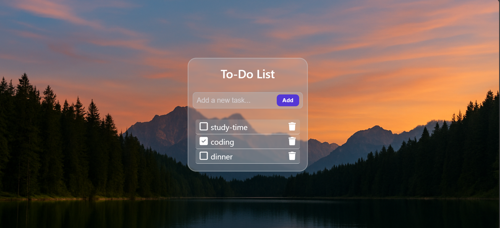

# 📌 To-Do List App
## 📖 About

A simple To-Do List App made with HTML, CSS, and JavaScript.
You can add tasks, mark them as complete ✅, and delete 🗑️ them.
The app is designed with a clean UI for a better user experience.

## 🚀 Features

➕ Add new tasks easily

✅ Mark tasks as complete

🗑️ Delete tasks anytime

📱 Responsive design

🎨 UI-focused (modern, simple & user-friendly)

## 🛠️ Tech Stack

HTML5

CSS3

JavaScript (Vanilla JS)

## 📸 Screenshot

## 🔗 Live Demo

👉 Click here to view project

[Click here to visit](https://codebygunjan.github.io/To-Do-List-App/)

## 💡 How to Use

Clone the repo

git clone https://github.com/codebygunjan/To-Do-List-App.git

## 🍂 Author

Made with ❤️ by Gunjan!

## ⭐ Show your support
If you like this project, please give it a ⭐ on GitHub!